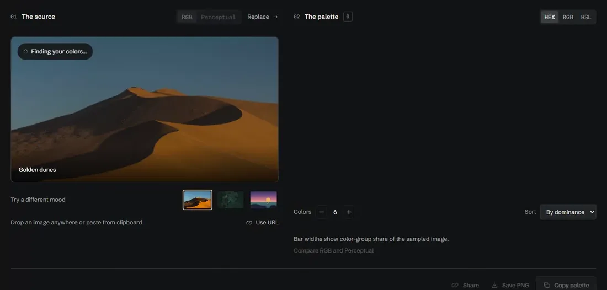
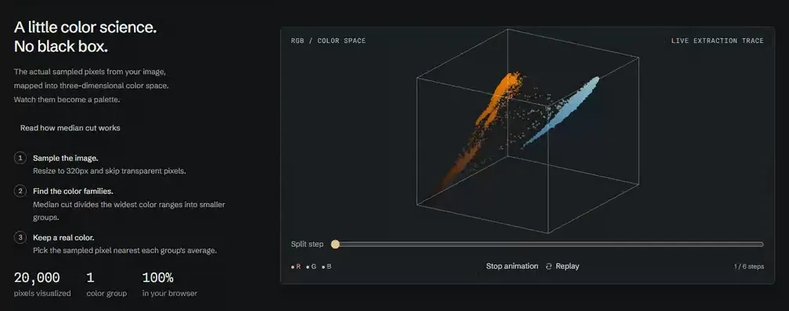
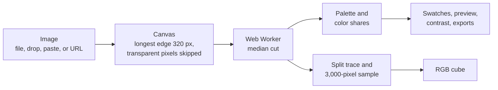

# Palette Extractor

[](https://github.com/relaywright/palette-extractor/actions/workflows/ci.yml)
[](LICENSE)

**Color, pulled into focus.** A private color studio that takes an image from inspiration to usable design values. Upload a photo, explore its palette, see it applied to an identity, and take the colors straight into your next project.

[Open the live app](https://palette-extractor.relaywright.workers.dev/)



## Explore the palette

### Watch it happen

- **The photo turns into its palette.** On first load the sample photo lifts into its pixels, the pixels settle into a turning 3D cloud of color, the cloud splits into groups, and each group condenses into a swatch that flies to its slot. Any click, tap or key skips to the end, and swatches work throughout.
- **Start immediately.** Three bundled sample moods demonstrate the tool without an upload.
- **Bring your own image.** Upload, drop a file anywhere, paste an image, load a public image URL, or point your phone's camera at something and watch the palette follow it live. Tap to freeze a frame.

### Touch the colors

- **See where a color lives.** Hover, focus or tap a swatch and the photo dims everywhere except the pixels that went into it, while the same group lights up in the cloud.
- **Pick straight from the photo.** A loupe shows the exact pixel under the pointer and which swatch owns it. Click to pin that pixel's color into the palette.
- **Recolor the photo.** Nudge any swatch's lightness, chroma or hue and the photo recolors in real time on the GPU, using palette-based recoloring in OKLab. The preview, contrast checks, exports and share link all follow your edits, and Reset brings back the extracted colors.
- **Author the theme.** Choose which colors play surface, type and accent, then export the theme as CSS variables, a Tailwind v4 `@theme` block or JSON, with a reversed set included.
- **Keep your hands on the keyboard.** Number keys select swatches, C copies, Shift+C copies the palette, S copies the share link, and ? lists every shortcut.

### Know the color

- **Find and keep your colors.** Request 4–10 colors, pin favorites while re-extracting around them, sort by hue or lightness, and copy HEX, RGB, or HSL values.
- **Shade scales.** Every swatch gets an OKLCH scale from 50 to 950, gamut-mapped to sRGB with the CSS Color 4 method, with Display P3 values and a lightness curve. Exports can include the full scales.
- **Check readability two ways.** Every pair shows its WCAG 2 contrast ratio beside APCA Lc (the WCAG 3 draft method), with a plain note when the two disagree.
- **Preview color blindness.** Simulate protanopia, deuteranopia and tritanopia across the photo, swatches and identity preview, with a warning when two swatches become hard to tell apart.
- **Compare color spaces.** Switch between RGB and Perceptual (OKLab) grouping and see both palettes side by side, aligned color for color.
- **See it in context.** An editorial identity responds to the palette. Reverse light and dark to explore another direction. Low-contrast palettes get an honest explanation instead of an unreadable preview.
- **Take it with you.** Preview, copy, or download CSS variables, Tailwind v4 theme tokens, SCSS, SVG, or JSON. Save a PNG palette card or share a compact color-only link.

### On your phone

- **Built for one hand.** The tools open as a bottom sheet, and copying gives a small haptic tick where the phone supports it.
- **Install it and use it offline.** The app installs to the home screen and works without a connection after the first visit. On Android, share a photo straight into it from the gallery.

## How it works



[Read how median cut works](https://palette-extractor.relaywright.workers.dev/how.html), an interactive walkthrough that runs the quantizer on your own photo.



### Engineering decisions

- **Quantize off the main thread.** Each extraction runs in its own Web Worker, so the interface stays responsive on large photos. The downscaled canvas's raw pixel buffer is transferred to the worker rather than copied, and the worker filters and collects pixels itself, so the main thread only draws and hands off. When a newer image or setting supersedes a run, an `AbortController` terminates its worker, and a request counter discards stale URL loads. A failed upload leaves the last good palette in place.
- **Sample small, on purpose.** The image is drawn to a canvas with a longest edge of 320 px. That size came from benchmarking: 512 px took about four times as long with no visible gain, while 160 px let downscaling blur fine details into colors that were not in the photo.
- **Median cut, written from scratch.** There is no quantization library. Early splits go to the most populous box, which finds the dominant colors. The final quarter of splits weighs population by box volume in RGB space, which rescues small but distinct accents that population alone would ignore. The quantizer lives in [`packages/median-cut`](packages/median-cut), a standalone, zero-dependency workspace package this app depends on like any other.
- **Cut between clusters, not through them.** Instead of splitting exactly at the median, the cut point moves toward the middle of the wider side of the range, which tends to land in the gap between two color clusters.
- **Only real colors.** A box's average can fall between two clusters and invent a color that appears nowhere in the image. Each swatch is instead the sampled pixel nearest its box's average, and a regression test holds that line.
- **Pinning re-extracts around your picks.** Pinned colors stay put, and pixels close to them are excluded before the remaining swatches are found, so the new picks are genuinely different. Perceptual mode excludes by OKLab distance instead of RGB distance, so it keeps out perceptually similar pixels even when their raw RGB values differ.
- **Visualize the real run.** The worker returns the actual split sequence along with a pixel sample, so the cube replays the run that produced your palette rather than a canned illustration. It respects reduced-motion preferences and pauses while off screen.
- **Perceptual grouping without a color library.** Perceptual mode runs the same from-scratch median cut on OKLab coordinates, rescaled into the 0–255 domain the RGB path already uses. A medium and a bright green can sit only 40 apart in RGB while looking clearly different, and a yellow-green 50 away can look almost identical to the bright one. Asked for two swatches, RGB spends one on the near-duplicate; Perceptual spends it on the difference a viewer can see, and a unit test holds that example. Every swatch is still a real source pixel, and RGB mode is unchanged byte for byte, checked against output recorded before the OKLab path existed.

- **A WebGL2 renderer with no library.** The color cloud draws up to 20,000 points in one draw call; a single progress uniform blends each point between its place in the photo and its place in color space. It measures its own frame times and drops points on slow devices, falls back to Canvas 2D without WebGL2, and loads only after the photo has painted so it never delays the first view.
- **Recoloring that respects the photo.** Each pixel is weighted to the palette colors in OKLab with Gaussian falloff and moves by the weighted sum of your swatch edits, then is gamut-mapped back into sRGB. With no edits the output is byte-identical to the input, and a test holds that line. Without WebGL2 the same math runs on the CPU.
- **Offline without stale deploys.** A hand-written service worker precaches each build's exact file list, named by a content hash. Pages always try the network first, so a new deploy shows on the next online visit, and a deploy that arrives only partly never replaces the saved version.

Swatches are colors from the downscaled sample, and resizing can blend neighboring pixels. Quantization is an approximation, and a simple image may return fewer colors than requested.

## Performance

| Measure                                 | Result                                                                                                                  |
| --------------------------------------- | ----------------------------------------------------------------------------------------------------------------------- |
| 12 MP photo, upload to rendered palette | ~0.4 s median, ~0.8 s with 4× CPU throttling                                                                            |
| JavaScript, gzipped                     | 73 kB including React at first load (budget 75 kB); the color stage (10 kB) and each tool panel (1–5 kB) load when used |
| CSS, gzipped                            | 11 kB at first load                                                                                                     |
| Lighthouse, desktop                     | Performance 100 · Accessibility 100 · Best practices 100 · SEO 100                                                      |
| Lighthouse, mobile                      | Performance 95 · Accessibility 100 · Best practices 100 · SEO 100 · Total blocking time 131 ms · Largest paint 2.5 s    |
| Lighthouse, explainer page              | Performance 99 on mobile, 100 on desktop; 100 in every other category                                                   |

Extraction timings come from the production build in Chromium on an AMD Ryzen 7 5800X3D. Lighthouse figures are the median of three runs on the production build in CI, where a performance score under 85 on mobile or 95 on desktop, or under 100 in any other category, fails the build; mobile runs simulate slow 4G and a 4× CPU slowdown.

## Project structure

```
src/
  App.tsx            Page layout; composes the hooks below
  hooks/             Image loading, palette state, copy feedback, shared links
  components/        Swatches, contrast, identity preview, exports, loupe,
                     shade scales, error boundaries for lazy parts
  stage/             The color stage: WebGL2 renderer, 2D fallback, timeline
  recolor/           Live recolor: the GPU shader and its CPU fallback
  how/               The median cut explainer page (how.html)
  lib/               Framework-free logic: worker entry, color math, APCA,
                     color-vision simulation, exporters, share encoding
public/sw.js         The offline worker (each build fills in its file list)
packages/
  median-cut/        The quantizer, published standalone as
                     @relaywright/median-cut, with its own README
tests/               Browser tests, one file per feature
scripts/             Build checks: bundle budget, service worker build
```

## Quality checks

Every push and pull request runs [CI](.github/workflows/ci.yml): a formatting check, type checking, 509 unit tests, a production build with a bundle budget (75 kB gzipped at first load), 496 browser tests in Chromium, and Lighthouse on mobile and desktop settings.

Unit tests cover the quantizer, color math, APCA and WCAG contrast, color-vision matrices, shade scales, recoloring, exporters, color names, share links, and theme roles. Browser tests exercise uploads, drag and paste, URL loading, the live camera (with a fake device), copy formats, downloads, sharing, pinning, the loupe, recoloring, keyboard shortcuts, offline use and updates across deploys, reduced motion, both stage renderers, and responsive layouts, with automated axe accessibility scans at phone, tablet, and desktop widths.

## Privacy and architecture

React 18, TypeScript, Vite, hand-written CSS, Canvas, and Web Workers. No runtime dependencies beyond React. No accounts, backend, database, API keys, or analytics. Bundled images and self-hosted fonts mean the default experience makes no external requests.

Local uploads never leave the browser. **Public image URLs are different:** they are fetched from their host and, when direct cross-origin loading fails, through the `images.weserv.nl` proxy. Shared links contain the color values only, never the source image.

## Run locally

Node.js 20 or later (22+ recommended).

```sh
npm ci
npm run dev          # local dev server
npm test             # unit tests
npm run typecheck
npm run format       # apply Prettier
npm run build        # production files in dist/
```

Browser tests:

```sh
npx playwright install chromium
npm run test:e2e
```

To reuse an installed Chromium browser, set `PLAYWRIGHT_CHROMIUM_EXECUTABLE` to its full executable path. Production files can be deployed to any static host, including Cloudflare Pages or Workers Static Assets.

## License

[MIT](LICENSE)

## Credits

Sample photography: [Andrew Svk](https://unsplash.com/photos/0s9oD70F-l4) and [Domenico Gentile](https://unsplash.com/photos/N7Q0Ir-hXeA), under the [Unsplash License](https://unsplash.com/license). The coastal illustration is included in this repository. Schibsted Grotesk and Spline Sans Mono are self-hosted under the SIL Open Font License; license files are in `public/fonts/`.

The base CSS reset is adapted from [Tailwind CSS preflight](https://github.com/tailwindlabs/tailwindcss) (MIT). Contrast guidance follows [W3C's WCAG contrast criteria](https://www.w3.org/WAI/WCAG22/Understanding/contrast-minimum.html). A color-pair check does not certify an entire design's accessibility.
